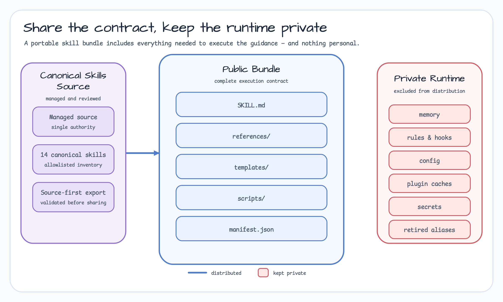
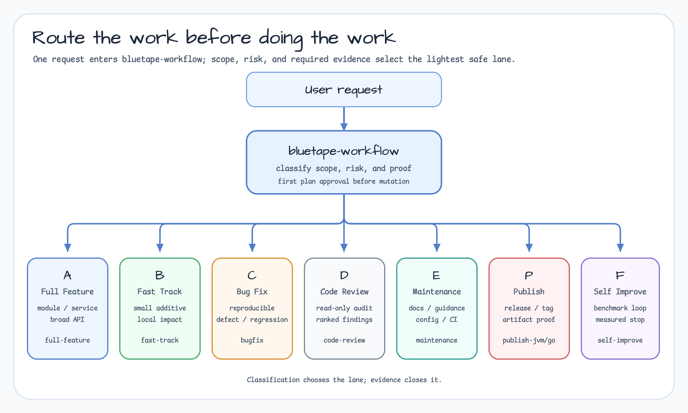
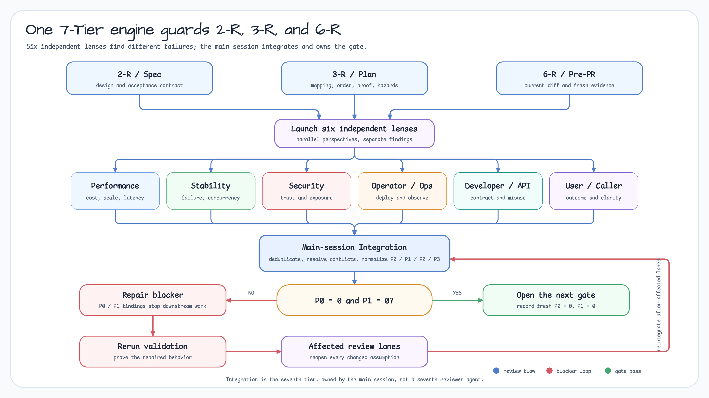

# Bluetape Skills

English | [한국어](README.ko.md)

Installable, canonical [Codex skills](https://developers.openai.com/codex/skills/) for Bluetape development workflows. Each skill is shipped with the references, templates, scripts, and agent prompts it needs; retired aliases and personal runtime state are intentionally not distributed.

## What gets shared

The repository is a portable public bundle, not a copy of a maintainer's Codex home. It includes the complete reusable skill units while keeping user-specific configuration and runtime data outside the distribution boundary.

[](docs/images/bluetape-skills-public-bundle-boundary-01.svg)

## Install

Install the stable release, validate the bundle, and run the installer:

```bash
git clone --branch v1.2.1 --depth 1 https://github.com/bluetape4k/bluetape-skills.git
cd bluetape-skills
./scripts/validate.sh
./scripts/install.sh
```

Validation requires Bash, `rg`, Python 3, and `uv`. It checks the public bundle boundary and workflow contracts, then runs the bundled workflow and diagram-audit regression suites in ephemeral Python environments.

The installer writes to `${CODEX_HOME:-~/.codex}/skills`. It refuses to overwrite an existing canonical skill. Use `--force` only when you want a timestamped backup of the installed skill before replacement.

```bash
./scripts/install.sh --dry-run
./scripts/install.sh --codex-home "$HOME/.codex"
./scripts/install.sh --force
```

Restart Codex after installation so the new skills are discovered.

To follow unreleased changes, clone the default `develop` branch by omitting the `--branch v1.2.1 --depth 1` options. The `main` branch is reserved for reviewed stable-release promotion. Published versions and downloadable bundles are available from [GitHub Releases](https://github.com/bluetape4k/bluetape-skills/releases).

## Update

Release tags are immutable. To upgrade a stable installation, clone the newer tag into a fresh directory, validate it, and replace the installed skills with a backup:

```bash
git clone --branch v1.2.1 --depth 1 https://github.com/bluetape4k/bluetape-skills.git bluetape-skills-v1.2.1
cd bluetape-skills-v1.2.1
./scripts/validate.sh
./scripts/install.sh --force
```

If you intentionally track `develop`, update that branch in place:

```bash
git pull --ff-only
./scripts/validate.sh
./scripts/install.sh --force
```

Review `git log` and `git diff` before forcing an update if you have local changes to installed skills.

## Use

Start with `$bluetape-workflow` for a Bluetape ecosystem task. It classifies the work and routes it to the lightest appropriate lane.

[](docs/images/bluetape-workflow-type-router-01.svg)

| Need | Skill |
| --- | --- |
| Reproducible defect | `$bluetape-bugfix` |
| Small, bounded change | `$bluetape-fast-track` |
| New module, dependency, or broad API work | `$bluetape-full-feature` |
| Kotlin/JVM implementation | `$bluetape-kotlin-patterns` |
| Go, Python, or Rust work | `$bluetape-go-patterns`, `$bluetape-py-patterns`, `$bluetape-rs-patterns` |
| Documentation and localization | `$bluetape-writer` |
| Diagrams and charts | `$bluetape-diagram` |
| JVM or Go publishing | `$bluetape-publish-jvm`, `$bluetape-publish-go` |

The `skills/manifest.json` file is the machine-readable inventory. Skill folders include their own `SKILL.md` and referenced material, so copy the complete folder rather than only `SKILL.md`.

## Native workflow runtime

Version 1.1.0 adds the Phase 2 native runtime to `$bluetape-workflow`. Manifest 1.1 defines run and lane lifecycles, liveness decisions, topology-based completion, receipt-backed recovery, and bounded evidence. The guarded `bluetape-flow.py` CLI is the only writer for `.bluetape` workflow state.

The CLI records and validates native coordination; it does not replace Codex agent tools. The main session still performs agent spawn, messaging, waiting, and interruption, then records the observed result. Direct writes to `.bluetape` state are unsupported.

`code-review` and `self-audit` are external companion skills referenced by the workflow but intentionally excluded from this canonical Bluetape bundle. Install them separately when using the Code Review route or harness self-audit gate.

## 7-Tier review gates

Full Feature work reuses the same 7-Tier review engine at `2-R` Spec Review, `3-R` Plan Review, and `6-R` Pre-PR Review. Six independent perspectives—Performance, Stability, Security, Operator/Ops, Developer/API, and User/Caller—find different failures; main-session integration is the seventh tier.

[](docs/images/bluetape-workflow-7-tier-review-01.svg)

Any remaining `P0` or `P1` finding blocks the next gate. Repair the blocker, rerun validation, reopen every affected review lane, and integrate again. Work advances only when the latest result is `P0=0` and `P1=0`.

## Guides

- [Sharing and installing Bluetape skills](https://bluetape4k.github.io/blog/bluetape-skills-sharing/) explains the public bundle, source ownership, installation, updates, and collaboration model.
- [Using the Bluetape workflow](https://bluetape4k.github.io/blog/bluetape-skills-workflow-guide/) explains task classification, checklist gates, staged multi-perspective review, and the P0/P1 zero-blocker loop.

The guides contain detailed source-sync and execution-lane diagrams that complement this quick-start README.

## What is deliberately excluded

This public bundle contains only canonical reusable guidance. It does not include user preferences, memories, local rules, hooks, configuration, plugin caches, secrets, or compatibility aliases such as `bluetape4k-*`. That boundary keeps the bundle safe to share and prevents private machine state from becoming part of another developer's setup.

## Contribution and release policy

This repository is a distributable mirror of the maintained canonical skill source. Open an issue for a correction or proposal; maintainers review it against the source and export it in a later bundle update. Do not rely on retired skill names in new documentation or automation.

Development and maintenance pull requests target the default `develop` branch. The `main` branch accepts reviewed release-promotion pull requests only and remains aligned with the latest stable release until the next promotion. Release tags are signed and immutable.

## Verification

Run `./scripts/validate.sh` after cloning or updating. It verifies the canonical inventory, required front matter, rendered executable names, external companion declarations, workflow contracts, the workflow regression suite, and the absence of private/runtime payload.

## License

MIT. See [LICENSE](LICENSE).
